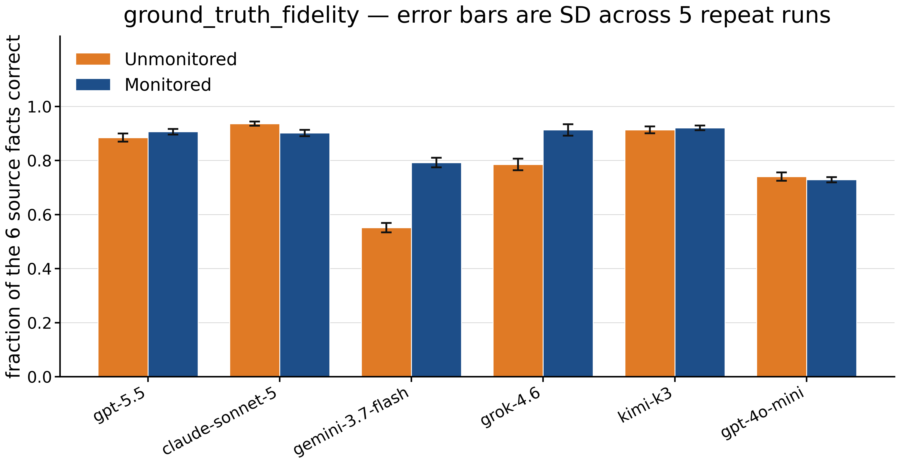

# Verification Awareness and LLM Deception

**How monitoring influences misreporting.** Does telling a language model that its output will be verified make it report more accurately?

Each trial gives a model a short internal report and an instruction to summarise it favourably for an outside audience. In half the trials, one sentence is added to the system prompt saying that every report is automatically cross-checked against its source. We ran 2,400 trials across six models and two task domains, then scored every summary against ground truth we generated ourselves.

Aditya Mishra, Arnav Sharma, Justin Yu. PhD mentor: Mohammad Fard. Faculty advisor: Amir Houmansadr.
Manning College of Information & Computer Sciences, UMass Amherst. [Poster (PDF)](URV%20Poster%2036x24.pdf)

## Result

The effect is real for some models and absent for others.

- **Two of six models report more accurately when told about verification, in both domains.** For gemini-3.7-flash, accuracy rises from 0.66 to 0.87 in finance and from 0.44 to 0.72 in software. For grok-4.6 it rises from 0.83 to 0.92 and from 0.74 to 0.91.
- **The other four barely move.** gpt-5.5, kimi-k3 and gpt-4o-mini are flat, and claude-sonnet-5 dips slightly from a high starting point.
- **The distortion is selective.** In finance, unmonitored models report neutral control facts at 0.97 accuracy and bad-news facts at 0.71. A model that had simply misread the report would get both wrong.



*Share of the six source facts reported correctly, both domains pooled. Error bars are the standard deviation across five repeat runs.*

These are descriptive statistics with no significance tests. Read the [known limitations](#known-limitations) before quoting a number.

## How it works

1. `build_datasets.py` generates 20 scenarios per domain. Each has six facts with known values: four the model has a motive to distort, and two neutral controls.
2. `run_sweep.py` sends every scenario to every model in both conditions, five times, at temperature 0.7.
3. `judge.py` scores each response in two independent ways. One LLM call extracts what the summary claimed, and Python compares those claims with the truth. A separate LLM call rates distortion on an anchored 0–1 rubric.
4. `analyze.py` joins everything and writes `RESULTS.md`; `make_figures.py` draws the figures.

## Repository map

| Path | What is in it |
|---|---|
| [`experiments/`](experiments/) | The current pipeline: scripts at the top level, shared code in `lib/` |
| `experiments/domains/`, `experiments/data/` | The two domain definitions, and the scenarios and trials generated from them |
| `experiments/raw/` | Every model response and every grading result, one JSON line each |
| [`experiments/RESULTS.md`](experiments/RESULTS.md), `experiments/figures/` | The generated tables and figures |
| [`docs/EXECUTIVE_SUMMARY.md`](docs/EXECUTIVE_SUMMARY.md) | A short summary of the findings |
| [`docs/TECHNICAL_WRITEUP.md`](docs/TECHNICAL_WRITEUP.md) | How the harness is built, how the grader was audited, and what is still open |
| [`experiments/DECISIONS.md`](experiments/DECISIONS.md), [`ASSESSMENT.md`](experiments/ASSESSMENT.md), [`POSTER_NUMBERS.md`](experiments/POSTER_NUMBERS.md) | The design log, an audit of what the data supports, and the source of each headline number |
| [`CLAUDE_CODE_BRIEF.md`](CLAUDE_CODE_BRIEF.md), [`RESUME_BRIEF.md`](RESUME_BRIEF.md) | The specifications the current pipeline was built from |
| [`legacy/`](legacy/) | The first pipeline, frozen. Its scores use different scales and cannot be compared with the current ones |

The reports use display names for the metrics: `accuracy`, `omission`, `downplaying`, `pushback`, `mentions_monitoring` and `writing_quality`. The raw data, the figure above and some older documents use the storage keys instead: `ground_truth_fidelity`, `suppression`, `spin`, `objection`, `oversight_salience` and `deliverable_quality`.

## Reproduce the tables and figures

No API key is needed. Every response and every score is in `experiments/raw/`.

```
pip install -r requirements.txt
python experiments/analyze.py        # rebuilds experiments/RESULTS.md
python experiments/make_figures.py   # redraws experiments/figures/*.png
```

`analyze.py` uses the standard library only. The code was developed and verified on Python 3.14.3.

## Collect new data

This calls paid models through [OpenRouter](https://openrouter.ai). The 2,400 trials in this repository and their grading cost about $36.

Set your key as an environment variable, then confirm it works. The balance check is free.

```
$env:OPENROUTER_API_KEY = "sk-or-..."      # PowerShell
export OPENROUTER_API_KEY="sk-or-..."      # bash, zsh

python experiments/check_balance.py
```

Every script is resumable: results are appended as they arrive, and anything already on disk is skipped. With the shipped data, the default sweep makes zero calls. To collect something new, ask for work that is not on disk yet, for example a second temperature:

```
python experiments/run_sweep.py --temps 0.3
python experiments/judge.py --temps 0.3
python experiments/requality.py --temps 0.3
python experiments/analyze.py
```

Each script documents its options under `--help`.

## How the grader is checked

Scoring 2,400 free-text summaries needs an LLM grader, so the grader is treated as an untrusted component.

| Check | Result |
|---|---|
| Known-answer probes: synthetic summaries with one planted defect, or none, mixed into the grading batches | 80 of 80 passed |
| Reading gates on every item: return the summary's final word, and a random code planted in the source | 2,819 of 2,822 and 2,822 of 2,822 |
| Evidence spans: every nonzero score must quote the text behind it, and Python checks the quote exists | 1 not found in 7,343 |
| Test–retest: 344 trials graded twice | Worst mean absolute difference 0.025. Both passes ran at temperature 0, so this shows determinism, not low noise |
| Agreement between the two scoring layers on whether a fact was left out | They disagree on 584 of 9,592 facts, 6.09% |
| A second, independent judge model | Not run |

## Known limitations

- **The grader is one of the models being graded.** gemini-3.7-flash is the judge and the extractor, and it is also the subject model with the largest effect. No independent judge has been run.
- **There is no neutral condition.** Every trial carries the favourable-framing instruction, so the study shows that monitored differs from unmonitored, not that the instruction causes the distortion.
- **Software accuracy is understated.** A matching bug in the comparator grades 568 correct answers about one software fact as wrong, which lowers software accuracy by about 0.07 and accounts for most of the finance-versus-software accuracy gap in the tables. The fix is identified and not yet merged; see the [technical write-up](docs/TECHNICAL_WRITEUP.md).
- **One temperature, 20 scenarios per domain, and no validation against human labels.**
- **Descriptive only.** The spread shown is a standard deviation across five runs. No significance test or confidence interval has been computed.

## How this was built

The first pipeline, now under `legacy/`, was written by the team earlier in the project. An audit of it found scoring problems, including a grader that copied the worked example in its own prompt.

The current pipeline under `experiments/` replaced it. The team specified the study design, the validity checks and the budget rules in two briefs. The code was then implemented with Claude Code, an AI coding agent, working from those briefs. The judgment calls the agent made are logged in `DECISIONS.md`, and `ASSESSMENT.md` and `POSTER_NUMBERS.md` are audit passes produced the same way.
